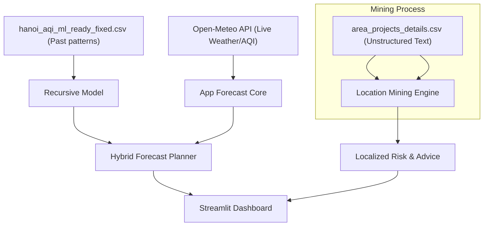

# BDM Final Project Proposal (Updated: Safe-Trip Air & Construction Planner)

## Team Information

- Team Number: 17
- Members: Tran Nam Son (2301140089), Nguyen Duc Manh (2301140061), Do Hoang Khoi (2301140054)

## Project Title

Hanoi Safe-Trip: A Location-Aware Air Quality & Construction Hotspot Planner for Students

## Track

Data Mining and Forecasting (with Text Mining and Multi-source Data Fusion)

---

## 1. System Architecture (How it Works)

This project isn't just a simple "predictor"—it's a multi-source intelligence system that combines historical patterns, live weather, and mined urban data.

### File Manifest (The "Engine Room")

| File | Purpose (Simple Terms) |
| :--- | :--- |
| `main/location_mining.py` | **The Detective**: Reads messy project names and "mines" out the district (e.g., Thanh Xuân). |
| `main/forecasting_core.py` | **The Brain**: Contains the math for the weather-driven model and the advice logic. |
| `web/app.py` | **The Face**: The interactive website where you pick your trip and see results. |
| `area_projects_details.csv` | **The Raw Intel**: A list of construction projects in Hanoi scraped from public notices. |
| `hanoi_aqi_ml_ready_fixed.csv` | **The Memory**: 2 years of past weather & air data used to train the model. |

---

## 2. User Experience: What You See & What It Means

We designed the app to be "Decision-First." Here is a breakdown of the interface:

### A. The Planner Sidebar (Input)
- **Mode Selection**: Switch between "Historical" (testing the model on old data) and "Upcoming Planner" (looking into the future).
- **Destination District**: Pick where you are going. This is where the **Data Mining** happens—it looks up if that district is a "Construction Hotspot."
- **Comparison Toggle**: Turn on the "History-based model" line to see how our pure AI model compares to the live world-wide forecast.

### B. The Forecast Snapshot (The "Now")
- **AQI Band**: Tells you if the air is "Fresh," "Moderate," or "Unhealthy" in simple colors.
- **Construction Risk**: A unique badge (Low/Moderate/High) discovered from mining the project CSV. **High risk** means even if the air looks okay, it might be dusty at street level.

### C. Recommended Activity Advice (The "Action")
We use three specialized tabs to give tailored advice:
1.  **🏃 Exercise**: Intense breathing means high risk. We warn you to stay inside if PM2.5 or construction is high.
2.  **🚲 Commuting**: Focuses on practical travel (e.g., "Wear an N95 mask today due to road dust in this district").
3.  **☕ Hanging Out**: Recommends whether an outdoor cafe is a good idea or if you should stick to air-conditioned malls.

### D. Data Mining Dashboard (The "Insight")
Located at the bottom, this section proves the data mining works. It shows:
- Which districts have the most active construction projects.
- The balance of Urban vs. Rural development in Hanoi.
- **Why this matters**: High project density creates "dust spikes" that simple weather stations often miss.

---

## 3. Simplified "Plain English" Explanation (The "Dummy" Guide)

### "Why is this better than a standard weather app?"
Most apps just give you a single number for the whole city. Our app knows that **Thanh Xuân** might be dustier than **Tây Hồ** because of a massive housing project on Nguyễn Trãi street. We combine the general "big picture" (API) with "local street smarts" (Data Mining).

### "How does the 'Mining' work?"
Imagine you have a big pile of sentences. Our "Detective" script (`location_mining.py`) scans every sentence for keywords like *"Quận Cầu Giấy"* or *"Huyện Thanh Trì"*. It then counts these occurrences to figure out where the "danger zones" for dust are.

### "What is the 'History-based' line?"
In the future planner, we show two lines for fun.
- The **Main Forecast** uses the latest live sensors.
- The **History-based line** shows what the AI *thinks* would happen based purely on its training from past years. It’s a way to see how much our "past memories" still apply to today's weather.

---

## Deliverables

- **Codebase**: Fully commented scripts for mining and forecasting.
- **Data Bundle**: All CSV files and the trained AI model bundle.
- **Streamlit App**: The interactive web dashboard.
- **Documentation**: This proposal and a technical Walkthrough.

---

## Scope Statement

The project prioritizes **student safety decision-support**. It transforms "abstract data" into "concrete advice" like: *"Don't exercise outside in Thanh Xuân today—it's too dusty."*
